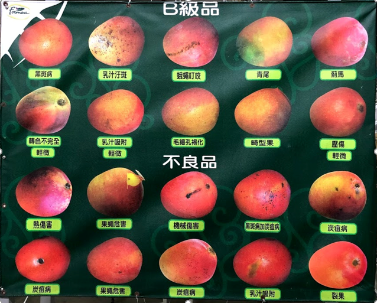
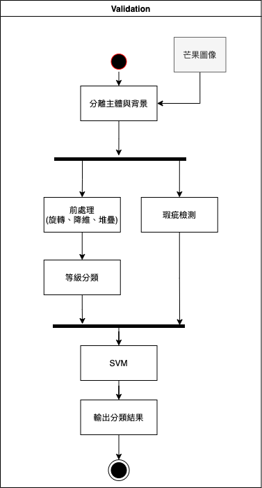
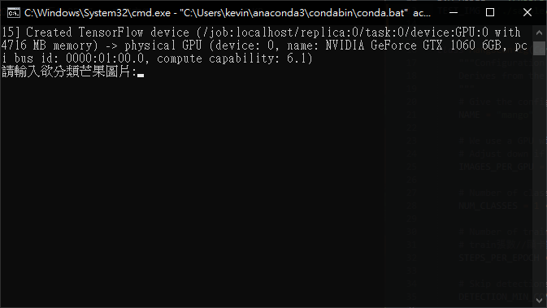
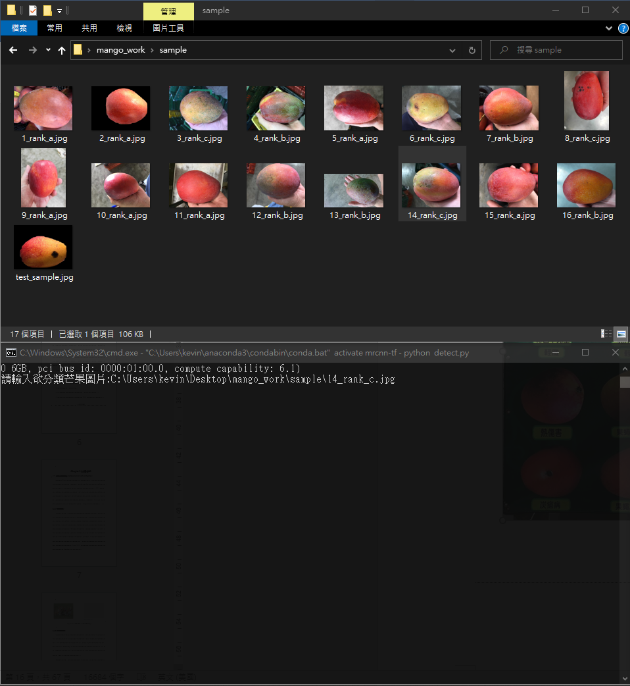
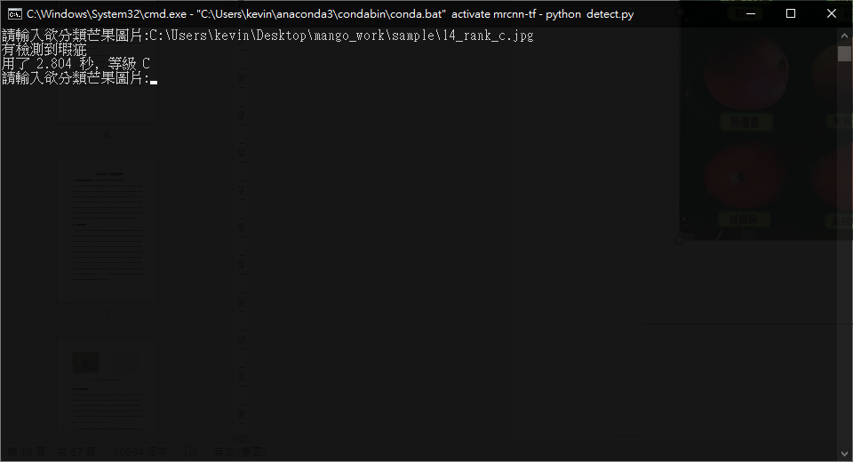

# 芒果等級分類(Mango Sorting Application)




**本專案目標為將採收芒果分成三種等級:分別是**

* 外銷，等級A
* 內銷，等級B
* 食品加工，等級C

<br>

## 執行流程與原理:

本研究使用Mask R-CNN進行ROI(Region of Interest)的追蹤，再透過CNN(Convolutional Neural Network)及SVM(Support Vector Machine)的搭配提出一種可辨識芒果外在品質之分類系統。在Mask R-CNN使用上，除了進行主體與背景的分割外，還進行了芒果之瑕疵檢測。前景分割後的圖像經過CNN的輸出，再搭配瑕疵檢測輸入SVM進行再分類得出分類結果。CNN訓練的過程採K-Fold的交互驗證方式，使得在有限的資料集可以充份的讓網路的權重更新較多的芒果特徵，而達到較佳的分類準確度。在驗證部分，本研究輸入800張訓練以外之圖像進行測試，其分類結果可達84.5%正確率，精確率與召回率分別在86%與84.4%。



<br>

## Package Install:

```python
# 建議安裝好且開啟虛擬環境後執行
pip install -r requirements.txt
```

**將以下連結之權重檔下載至h5s資料夾並解壓縮**

[權重連結](https://drive.google.com/drive/folders/1o01Omdjz4_gpMrNhwSQ1_x2r9cD7HV8J?usp=sharing)

```
https://drive.google.com/drive/folders/1o01Omdjz4_gpMrNhwSQ1_x2r9cD7HV8J?usp=sharing
```

<br>

## Usage:

```python
cd mango_work
python detect.py
```

**經過模型的讀取後，會出現以下字樣**



**此時可以將在sample裡的測試樣本*拖拉到shell裡**

*圖像的名稱rank後面為分類的正確等級*



**就會輸出結果**



